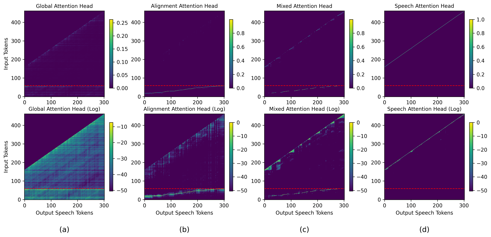
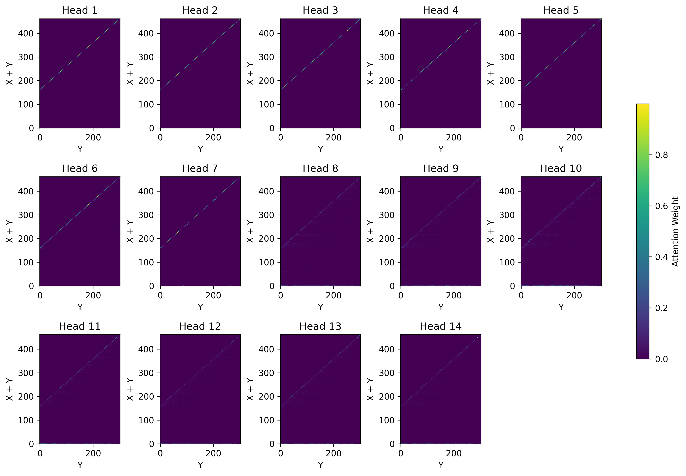
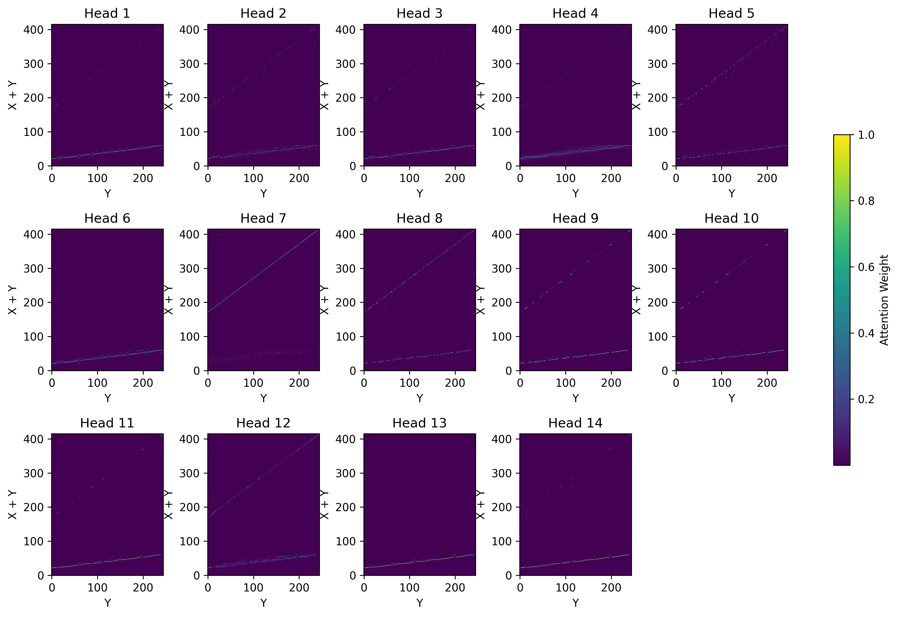

# Eliminating Stability Hallucinations in LLM-based TTS models via Attention Guidance

## Author Information
Author 11，2, Author 22, Author 32, Author 42, Author 52, Author 62, Author 72, Author 81, Author 91⋆  
1University A  
2Research Lab B, China  
**Mail：** anonymous@example.com

---

# Appendix

## Appendix A: Visualization of Four Types of Cross-Attention Heads

Visualization of attention probability for the four types of attention heads in CosyVoice2. The first row shows the original attention probability, while the second row presents the logarithmic version, enabling more intuitive observation of the regions attended to by the attention head. The red dashed line indicates the boundary between text tokens and speech tokens in the input sequence, with text tokens below the boundary and speech tokens above it.

In CosyVoice2, the LLM's attention heads can be categorized into four distinct types based on the distribution of their attention weights: global, alignment, mixed, and speech heads. The first of these, global attention heads, are predominantly found in the lower Transformer layers, where their primary role is to perform a global analysis and modeling of relationships across all text and speech tokens. Alignment heads are primarily located in the middle Transformer layers. They focus on the alignment between input text tokens and output speech tokens by mapping a continuous and monotonic path. This function is similar to the cross-attention mechanism in encoder-decoder architectures. Next, speech attention heads are concentrated near the output layers, where they model local details around the currently generated token. Finally, mixed attention heads are a hybrid of the alignment and speech types. They can also map the alignment between text and speech tokens, but these alignments are highly unstable.

### Visualization of Attention Scores in Transformer Layers
  
*Visualization of Attention Scores in the Transformer Layer-1 of the LLM*

  
*Visualization of Attention Scores in the Transformer Layer-8 of the LLM*

  
*Visualization of Attention Scores in the Transformer Layer-24 of the LLM*

## Appendix B: The effectiveness of LOAS

We manually designate heads-1 ~ head-7 in Transformer Layers-7 and Layer-8 as alignment heads. The two figures below visualize the attention scores of Transformer Layer-8. As can be seen, applying the LOAS significantly improves the alignment between text and speech tokens in the alignment heads, making it more continuous and focused. However, designating these alignment heads manually can introduce functional redundancy. Consequently, some heads fail to learn a proper alignment, which manifests as straight lines in the visualization, indicating alignment failure.

  
*Visualization of Attention Scores in the Transformer Layer-8 of the LLM without LOAS*

  
*Visualization of Attention Scores in the Transformer Layer-18 of the LLM with LOAS*